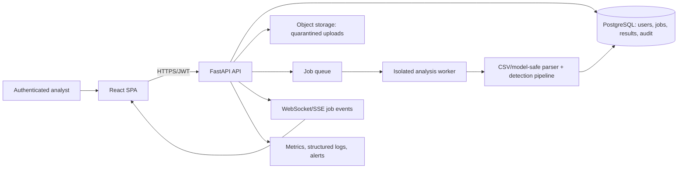

# Veritas: Verified Repository Audit and Completion Plan

**Audit date:** 2026-09-02  
**Scope:** outer repository at `/home/sai-krishna/Projects/Veritas` (the only sensible candidate for the canonical tree). The committed `Veritas/` directory is a divergent, nested duplicate and is not treated as authoritative.

## 1. Executive summary

**Verified fact:** Veritas is a FastAPI + React application for demonstrating detection and investigation of suspicious ML training data and serialized scikit-learn models. CSV analysis, a five-layer heuristic pipeline, forensic/defence response objects, SQLite history, model upload, and a dashboard UI are implemented.

**Verified fact:** It is not production-safe. The model endpoint executes `pickle.loads()` on untrusted uploaded bytes before it performs its class allow-list check (`backend/app/ingestion/model_engine.py:60`), enabling remote code execution. The API has only a hard-coded demo identity and no authorization (`backend/app/api/routes/auth.py:8`); state-changing endpoints are public.

**Conclusion:** retain the existing demo and detection components, but do not expose this deployment to untrusted users. The work should begin with eliminating unsafe pickle support (or moving it into an isolated worker), then access control, tests/CI, and reproducible deployment. ML accuracy must be presented as experimental until evaluated on an immutable held-out benchmark.

## 2. Evidence and execution limits

### Commands run

| Check | Result |
|---|---|
| `python3 -m compileall -q backend/app ...` | Passed. This is syntax-only, not behavioural verification. |
| `pip install -r backend/requirements.txt` in `/tmp/veritas-audit-venv` | Passed after network access was permitted. The UTF-16 file is accepted by pip, but is unsuitable for typical tooling. |
| `backend/_test_imports.py` | Passed; imports demo data, catalogue and route modules. It is not a test suite. |
| ASGI smoke requests | Passed: `/health`, `/`, `/api/v1/auth/me`; expected 404 responses for no-result routes; non-CSV upload returned 400. |
| Full upload of `tests/fixtures/test_upload.csv` | Did not complete within the available 30-second command window. This is a performance observation, not proof of a defect; profile it under a normal test runner. |
| `npm run build`, `npm run lint` | Not runnable before installation: `vite` and `eslint` were absent. |

**Unknown:** end-to-end browser behaviour, container build/run, and full valid-upload latency require a longer-running local/CI job. No claim that they work is made here.

## 3. Purpose, users, and actual capabilities

| Item | Assessment |
|---|---|
| Problem | Identify statistical patterns potentially consistent with training-data poisoning or anomalous learned parameters. |
| Intended users | Inference: ML/security analysts and demo evaluators; the code has no multi-user implementation. |
| Inputs | CSV files, `.pkl` model files, optional CSV with model scan, generated demo data, catalogue datasets. |
| Outputs | Suspicion score/verdict, layer data, likely attack classification, reconstructed narrative, defence recommendation, SQLite history, WebSocket notifications. |
| Research status | Experimental detection prototype. There is no training pipeline, versioned model artefact, labelled benchmark, baseline comparison, or reported precision/recall/F1. |

## 4. Repository map and dependency relationships

```text
frontend/                         React/Vite SPA; calls REST and WebSocket API
  src/services/api.js             API URLs and browser requests
  src/pages/                      Dashboard, upload, scan, history, reports, etc.
backend/
  app/main.py                     FastAPI app, CORS and lifespan
  app/api/routes/                 REST and WebSocket endpoints
  app/api/dependencies.py         singleton engines, caches and staged broadcasts
  app/ingestion/                  CSV parsing and unsafe pickle model loading
  app/detection/                  layers 1–5 and orchestration pipeline
  app/forensics/, defense/        classification, impact and response objects
  app/models/database.py          raw SQLite persistence
  app/demo/                       generated and catalogue data
  app/services/                   four unreferenced service modules
tests/fixtures/                   two CSV fixtures only
Veritas/                          divergent full duplicate — remove after migration verification
```

The normal CSV path is: `UploadPage.jsx` → `api.uploadCSV()` → `routes/upload.py` → `CSVIngestionEngine.ingest()` → a new `DetectionPipeline.run_on_upload()` → forensics/defence engines → cache + background SQLite write + staged WebSocket events → JSON response. `routes/models.py` follows the same pattern after `ModelScanEngine.ingest()` extracts model parameters.

Failure/security points are the public upload routes, unbounded pre-check body reads, synchronous CPU work in a short-lived `ThreadPoolExecutor`, global caches, raw `str(e)` returned to callers, and the pickle deserialization boundary.

## 5. Existing-analysis claims verified against code

| Claim | Evidence | Status | Required action |
|---|---|---|---|
| Five-layer detection exists | `backend/app/detection/layer1_statistical.py` through `layer5_federated.py`, `pipeline.py` | VERIFIED | Add isolated tests and calibrated evaluation. |
| Safe pre-execution pickle scanning | `model_engine.py:60` uses `pickle.loads` before checks | INCORRECT | Remove pickle input or isolate/restrict deserialization before object construction. |
| Authentication exists | `auth.py` always returns demo user; `ProtectedRoute.jsx` passes children through | NOT IMPLEMENTED | Implement identity, session/JWT validation, RBAC and ownership checks. |
| Docker Compose supports full stack | `docker-compose.yml` builds `./frontend`; no outer `frontend/Dockerfile` | INCORRECT | Add a frontend Dockerfile and compose health checks. |
| WebSocket is live pipeline streaming | `dependencies.py:54–99` sleeps after work completes | PARTIALLY VERIFIED | Label it staged notifications or stream actual stage events. |
| In-memory state is not worker-safe | module-level caches in `dependencies.py` | VERIFIED | Store jobs/results in database/Redis. |
| SQLAlchemy is used | `database.py` uses `sqlite3`; no imports found | INCORRECT | Remove dependency or adopt migrations/SQLAlchemy deliberately. |
| Nested project is duplicate | `diff -rq . Veritas` finds many differing files; nested-only `RedTeamPage.jsx` | VERIFIED | Select outer tree, migrate any intentional differences, then remove nested copy. |
| All history works | DB code exists; full flow not completed in audit | PARTIALLY VERIFIED | Add integration tests for writes/restart/history. |

## 6. Backend, frontend, database, and configuration review

### Backend and API

There are 35 declared routes (34 REST, one WebSocket) across `routes/*.py`. No route declares an authentication dependency. `POST /defense/quarantine`, `POST /defense/hitl/decide`, analysis endpoints and history reads are consequently exposed to any network caller. Generic exception handlers expose internal messages in `upload.py:100–101`, `models.py:87–88` and `datasets.py:201`.

The configured `Settings` object is effectively dead: `FORENSICS_SQLITE_PATH` is declared in `core/config.py` but `database.py` hard-codes a path beside the package. The module-level engine/caches in `api/dependencies.py` make multi-process results inconsistent. Each request creates a `ThreadPoolExecutor(max_workers=2)`, which does not provide a durable bounded job queue and makes CPU capacity difficult to control.

### Frontend

The SPA is a hand-rolled page switcher in `frontend/src/App.jsx`, not router-based navigation. It implements the current screens and calls endpoints through `services/api.js`. The default endpoint is a hard-coded Render URL rather than an explicit environment requirement. `axios`, `jwt-decode`, `socket.io-client`, `zustand`, and `@tanstack/react-query` have no source imports, as confirmed by source search. `AuthContext` only holds local state.

### Database

`models/database.py` uses thread-local SQLite/WAL, with two append-oriented tables whose payloads are JSON blobs. This is reasonable for a small demo audit log, but there are no migrations, retention, ownership, transaction/retry policy, or job records. SQLite write serialization and worker-local caches rule out confident multi-worker scaling.

### Dependencies and deployment

`backend/requirements.txt` is UTF-16 LE and pins every transitive package; normalize it to UTF-8 and separate direct requirements from a lock file. Remove unused dependencies only after an import/build test. `docker-compose.yml` has no database volume, no health checks, no production configuration, and cannot build the missing frontend image. There is no `.env.example`, CI workflow, SBOM, or dependency scan.

## 7. Security audit

| Priority | Issue and location | Attack/failure scenario | Fix and acceptance criterion |
|---|---|---|---|
| P0 | Unsafe deserialization, `model_engine.py:60` | A crafted pickle invokes code while loading, before `ALLOWED_CLASSES` is checked. | Prefer accepting a non-executable model interchange (e.g. ONNX/skops) and scan it. If pickle is temporarily retained, isolate it in a no-network, non-root disposable worker and use a restrictive unpickler before construction; test a malicious payload is rejected without side effects. |
| P0 | No authentication/authorization | Any caller reads history, uploads content, triggers defence decisions. | Add OIDC/JWT verification, roles (`viewer`, `analyst`, `admin`), resource ownership and audit events; unauthenticated calls must receive 401 and inappropriate roles 403. |
| P1 | Unbounded read before limit, `upload.py:29` and model route | Oversized bodies consume memory before rejection. | Enforce proxy/ASGI request-body limits, stream/chunk with byte counter, quotas and rate limits. |
| P1 | Wildcard CORS plus credentials, `main.py:29–35` | Misconfiguration and unsafe browser boundary for an authenticated app. | Environment allow-list exact HTTPS origins; credentials only when required; add CORS tests. |
| P1 | No secure upload design | Extensions are client controlled; CSV parser/model processing can exhaust resources. | Validate content/business limits, normalize server filenames, isolate stored files outside web root, malware scan where appropriate, enforce quotas/timeouts. |
| P2 | Detailed exception messages to callers | Internal library/path details are revealed. | Structured server logs with correlation IDs; public generic error schema. |
| P2 | No security headers/audit/secret policy | Weak operational traceability and browser posture. | Add headers at proxy/app, secret injection, audit log and dependency scanning. |

Python explicitly warns that `pickle` is not secure and only safe for trusted data; OWASP recommends authorization, allow-lists, content checks and request/file-size limits for uploads. [Python pickle documentation](https://docs.python.org/3/library/pickle.html), [OWASP File Upload Cheat Sheet](https://cheatsheetseries.owasp.org/cheatsheets/File_Upload_Cheat_Sheet.html).

## 8. AI/ML and research validation

**Implemented:** Layer 1 combines statistical distances/outlier rules; Layer 2 applies spectral analysis; Layer 3 combines multiple unsupervised detectors; Layer 4 calculates a causal-style validation signal; Layer 5 presents generated federated-client trust data. `ModelScanEngine` transforms learned parameters into rows and sends them through the same data-oriented pipeline.

**Important limitation:** Applying anomaly detection to serialised model parameters is not evidence that a model was poisoned. It can be an exploratory signal only without threat-model-specific validation. Spectral signatures are published for detecting poisoned examples in learned representation space under specified backdoor settings, not as a general guarantee for arbitrary CSV/model parameters. [Tran, Li & Madry, *Spectral Signatures in Backdoor Attacks* (NeurIPS 2018)](https://proceedings.neurips.cc/paper_files/paper/2018/hash/280cf18baf4311c92aa5a042336587d3-Abstract.html).

There is no documented label provenance, split policy, random seed, training run, ground truth, threshold calibration, baseline, or evaluation metric. The extensive rectification notes in `pipeline.py` are evidence of case-specific tuning, not held-out validation. Before a detection or compliance claim:

1. Write the threat model and supported data/model modalities.
2. Build a versioned benchmark with clean and labelled attack sets; keep test data immutable.
3. Fix seeds and capture package/data/model versions.
4. Compare each layer and the ensemble against simple baselines using precision, recall, F1, PR-AUC and false-positive rate, with confidence intervals.
5. Publish limitations and a model/dataset card; do not label reports as regulatory compliance certificates.

NIST AI RMF is a voluntary risk-management framework, not a report template or certification. Its governance/mapping/measuring/managing practices can guide evidence and controls. [NIST AI RMF 1.0](https://www.nist.gov/publications/artificial-intelligence-risk-management-framework-ai-rmf-10).

## 9. Target architecture



Keep FastAPI, React and the current detection modules. Replace only boundaries that are unsafe or not deployable: use PostgreSQL for multi-user production, object storage for uploads, a queue for bounded work, and isolated workers for any risky file parser. For a small authenticated pilot, SQLite may remain temporarily if single-process operation and backups are explicit.

## 10. Gap analysis and scope decisions

| Must have | Should have | Could have | Not required now |
|---|---|---|---|
| Safe model-input policy; auth/RBAC; upload limits; remove duplicate tree; executable tests/CI; frontend Dockerfile; documented configuration | Shared jobs/cache, migration system, structured logs, browser tests, rate limits, secure report provenance | Redis, S3-compatible store, observability dashboard, true streaming stage events | Rewriting React, replacing FastAPI, microservices, claims of EU AI Act certification |

## 11. Ordered completion roadmap

### Phase 0 — establish the canonical, reproducible baseline (P0)

1. Diff outer and nested trees; migrate explicitly approved differences only; delete committed `Veritas/` nested copy in a separate reviewable commit.
2. Convert `backend/requirements.txt` to UTF-8. Add `.env.example`, a direct dependency file plus lock strategy, and documented clean setup.
3. Add `frontend/Dockerfile`; update Compose with named DB volume, health checks, environment files and non-root containers. Validate `docker compose up --build`.

### Phase 1 — secure public boundaries (P0/P1)

1. Disable `.pkl` upload in production immediately. Add a safe model format/import path; if business requires legacy pickle, create a separately sandboxed worker before restoring it.
2. Add `backend/app/core/auth.py`, user/role persistence and an auth provider integration. Attach a required principal dependency to every API/WS route, then add per-result ownership checks.
3. Replace `main.py` wildcard CORS with parsed environment allow-list. Add request-size/rate limits at ingress and streaming limits in upload routes; return safe API error envelopes.

### Phase 2 — correctness and test foundation (P1)

1. Add `backend/tests/` pytest fixtures, temporary database override and FastAPI `TestClient`/ASGI integration tests.
2. Cover health/auth/RBAC, CSV happy/error paths, database persistence/restart, report/history ownership, defence mutation authorization, malformed CSV, oversized uploads and malicious model rejection.
3. Add deterministic layer unit fixtures and benchmark-contract tests. Do not hard-code expected scores until metric/calibration policy exists.

### Phase 3 — job/state architecture and observability (P2)

1. Replace in-process caches with persisted analysis jobs/results. Move CPU work from per-request executors to an application-level queue/worker with timeouts and cancellation.
2. Emit real job-stage events instead of post-completion sleeps; show queued/running/failed state in the UI.
3. Use structured logging, request/job IDs, metrics and safe exception reporting.

### Phase 4 — research validation and release (P1/P2)

1. Define supported threat models and collect versioned labelled benchmark data.
2. Implement evaluation scripts, fixed splits and baseline comparison; publish metrics/limitations alongside reports.
3. Add GitHub Actions: backend tests, frontend lint/build/tests, container build, dependency/security scan. Require all checks before release.

## 12. File-level implementation plan

| Task | Priority | Files | Implementation and validation |
|---|---|---|---|
| Remove unsafe model route | P0 | Modify `backend/app/api/routes/models.py`, `backend/app/ingestion/model_engine.py`; add `backend/tests/test_model_security.py` | Reject `.pkl` by configuration now; introduce a safe parser/isolated worker before re-enabling. Test malicious pickle causes no execution and returns a generic 4xx. |
| Auth/RBAC | P0 | Add `core/auth.py`, auth models/migration, test helpers; modify all `api/routes/*.py`, frontend auth client/context | Validate issuer/audience/expiry; apply principal/role dependencies and result ownership. Test 401/403/200 matrix. |
| Secure uploads | P1 | `routes/upload.py`, `routes/models.py`, `core/config.py`, ingress/Compose config | Centralise limits/config; stream or enforce upstream body cap; validate CSV schema/count/timeouts. Tests use oversized/chunked/malformed fixtures. |
| Configuration/database | P1 | `core/config.py`, `models/database.py`, new migration directory | Make `FORENSICS_SQLITE_PATH` effective; load all environment values once; add migration/backup policy. Test a temporary DB and restart persistence. |
| Test/CI baseline | P1 | Add `pytest.ini` or `pyproject.toml`, `backend/tests/`, `.github/workflows/ci.yml` | Run unit/integration tests and frontend `npm ci && npm run lint && npm run build` on every PR. |
| Docker full stack | P1 | Add `frontend/Dockerfile`, modify `docker-compose.yml`, `.env.example` | Multi-stage frontend build/serve, named volume, health checks, non-root. Acceptance: clean `docker compose up --build` and health/API smoke pass. |
| Jobs and events | P2 | `api/dependencies.py`, routes, new jobs/worker modules, frontend hooks/pages | Persist job status; bounded worker concurrency; events originate at actual stages. Test worker success/failure and reconnect. |
| Dependency/dead-code cleanup | P2 | manifests and `backend/app/services/` | First test imports/build; remove confirmed unused packages/services or wire services deliberately. |
| ML evaluation | P1 | Add `research/`, benchmark manifest, evaluation scripts/tests/docs | Reproducible metrics per attack and baseline. Acceptance: one command produces versioned metrics and report. |

## 13. Definition of done

The project is complete for an authenticated pilot only when: a clean build starts both services; all core CSV workflow paths and expected error paths are automated and passing; no untrusted pickle is deserialized in the API process; every REST/WebSocket route enforces identity/role/ownership; uploads/jobs are bounded and audited; persistence is migrated/backed up; frontend build/lint/tests and backend tests run in CI; configuration and deployment are documented; and all ML-facing claims are paired with reproducible benchmark metrics and explicit limitations.

For production, add an independent security review, threat-model review, operations runbook/alerts/backups, load testing, data retention/privacy policy and incident response exercises.

## 14. Realistic readiness assessment

| Area | Readiness | Basis |
|---|---:|---|
| Core demo functionality | 65% | Implemented modules and basic smoke checks; full fixture run not completed in audit window. |
| Frontend | 55% | Screens/API calls exist; build and browser flow not verified; auth absent. |
| Backend/API | 55% | Routes and persistence exist; public APIs, worker model and errors need work. |
| AI/ML evidence | 25% | Algorithms exist; no reproducible benchmark or metrics. |
| Testing | 10% | Syntax/import smoke scripts and fixtures only; no automated suite/CI. |
| Security | 5% | RCE path and no auth are release blockers. |
| Deployment | 20% | Backend Dockerfile exists; Compose frontend build is missing. |
| Overall production readiness | **15%** | Functional prototype, not a safely deployable service. |

## 15. Final engineering recommendation

Treat the current application as a valuable prototype, not as a partially finished production platform. In the next implementation cycle: **(1)** choose the canonical outer tree and make its build reproducible; **(2)** remove public pickle deserialization and lock down every route; **(3)** put critical workflows under automated tests and CI; **(4)** make Docker deployment demonstrably work; **(5)** only then replace local state with jobs/worker storage and validate ML performance against a documented benchmark. This sequence reduces immediate compromise risk before investing in polish or new features.
